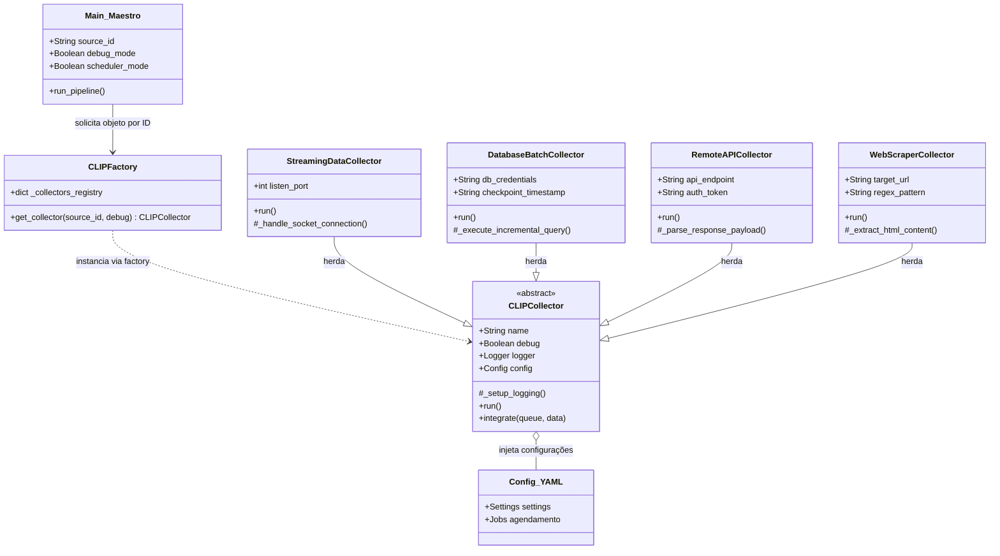

# CLIP - Coleta, Limpeza, Integração e Padronização de dados

<div align="center">
  
</div>

O CLIP é um framework de ingestão de dados modular e de alta performance, projetado para atuar como uma camada inteligente entre fontes de dados heterogêneas e ecossistemas de análise (como o Stack ELK).
Diferente de ferramentas de ETL convencionais, o CLIP foca na resiliência e na padronização, utilizando coletores modulares para buscar dados de diversas fontes por meio de métodos distintos como:
- APIs REST (JSON/XML)
- Protocolos de Rede (TCP/UDP/NMEA)
- Consultas em Bancos de Dados (PostgreSQL, SQL Server, MySQL)
- Monitoramento de Infraestrutura (ICMP Ping, Web Health Checks)


## Atualização e dependências de sistema
```
sudo apt update
sudo apt install -y python3-pip python3-dev libpq-dev xvfb rabbitmq-server
```

## Dependências do Python
```
pip install -r requirements.txt
```

## Interface de Linha de Comando (CLI)
```
clip -h
usage: clip [-h] [--source ID] [--list] [--show-jobs] [--debug] [--scheduler]

      __          
    o/  \o   ██████╗██╗     ██╗██████╗ 
    | [] |  ██╔════╝██║     ██║██╔══██╗
   o|    |o ██║     ██║     ██║██████╔╝
    \ __ /  ██║     ██║     ██║██╔═══╝ 
     o  o   ╚██████╗███████╗██║██║     
             ╚═════╝╚══════╝╚═╝╚═╝     
---------------------------------------
  Coleta, Limpeza, Integração e Padronização 
---------------------------------------

Gerenciamento da coleta de Dados.

options:
  -h, --help   show this help message and exit
  --source ID  Executa o pipeline para uma fonte específica.
  --list       Lista todos os coletores instalados no sistema.
  --show-jobs  Mostra o que está agendado no config.yml.
  --debug      Modo inspeção: não envia dados ao RabbitMQ.
  --scheduler  Inicia o agendamento automático (Maestro).
  
```


## Arquitetura do "Maestro"
O framework utiliza uma arquitetura baseada em Factory Design Pattern, permitindo que novos conectores sejam "plugados" ao sistema sem a necessidade de alterar o núcleo do software.

Fluxo de Dados:
- Collectors: Classes especializadas que executam a lógica de extração.
- Maestro (Scheduler): Orquestrador que gerencia frequências de execução e concorrência.
- Broker (RabbitMQ): Garante a persistência e o desacoplamento entre a coleta e a indexação.
- Standardization: Todos os dados são convertidos para o formato CLIP Standard JSON antes da integração.





## Extensibilidade & Plugins (Auto-Discovery)
O CLIP foi projetado sob o princípio de Open-Closed (Aberto para extensão, fechado para modificação). Adicionar uma nova fonte de dados ao ecossistema não requer alterações no núcleo do framework.
Como adicionar uma nova fonte (3 Passos)
### 1. Criar o Coletor:
Crie um arquivo Python em collectors/ herdando da classe base. O CLIP detectará automaticamente sua nova classe via Reflection/Auto-Discovery.

```python
from core.base import CLIPCollector

class MyNewSourceCollector(CLIPCollector):
    def run(self):
        data = self.my_custom_logic()
        self.integrate("my_queue", data)
        
```

### 2. Configurar a Fonte:
Adicione um arquivo YAML na pasta sources.d/. O Maestro lerá as configurações de agendamento e credenciais isoladamente.
```yaml
# sources.d/my_source.yml
monitor_config:
  id: my_new_source
  scheduler: "*/5 * * * *" # Exemplo Cron
  retention_days: 7

```

### 3. Deploy:
Reinicie o serviço ou execute diretamente via CLI:
```
clip --source my_new_source

```

## Estrutura de Diretório 
```Text
clip-framework/
├── core/                 # Núcleo do sistema (Factory, Scheduler, Base)
├── collectors/           # Plugins de coleta (Implementação novas fontes)
├── sources.d/            # Arquivos de configuração descentralizados (YAML)
├── logs/                 # Trilha de auditoria e histórico local
├── main.py               # Ponto de entrada do CLI
└── setup.py              # Script de instalação global


```

## 📄 Licença
Este projeto está sob a licença MIT. Veja o arquivo [LICENSE](LICENSE) para detalhes.
